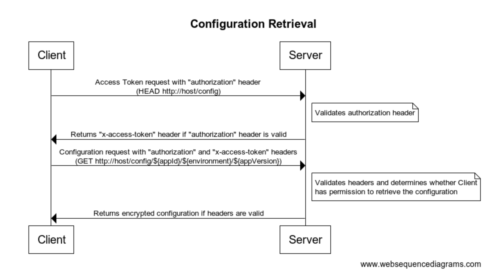
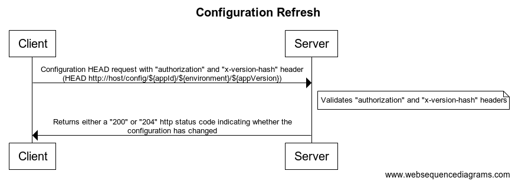

# elency-config - Clients

The following clients are currently available:

- `c#`: See the `c#` <a href="./clients/csharp/README.md">Readme<a/>.
- `node`: See the `node` <a href="./clients/node/README.md">Readme<a/>.
- `bash`: See the `bash` <a href="./clients/bash/README.md">Readme<a/>.

Clients communicate with the elency-config server to pull down configuration.

A client will initially pull down a configuration from the server.  The sequence diagram below illustrates the basic process.

If a client is configured to make use of near real time configuration updates then the following process is followed. If the configuration has actually changed then the `Configuration Retrieval` flow is followed.

